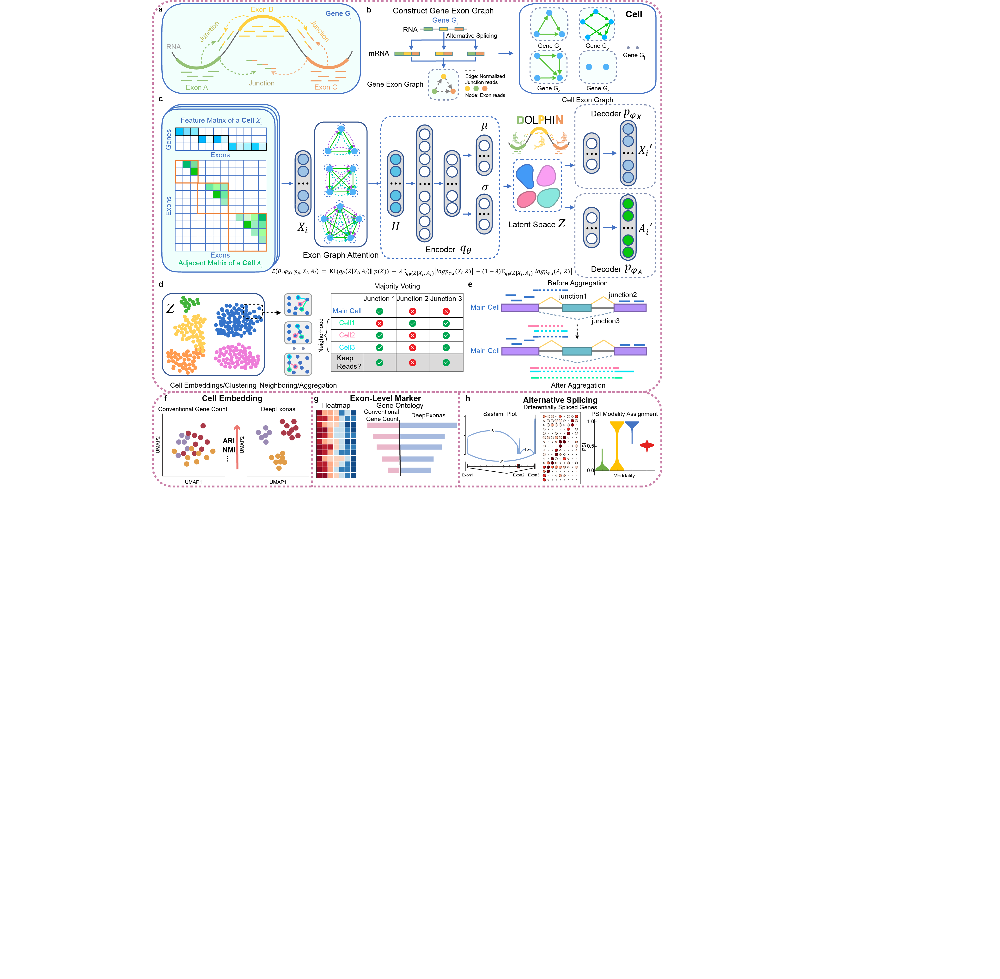

## Overview

The advent of single-cell sequencing has revolutionized the study of cellular dynamics, providing unprecedented resolution into the molecular states and heterogeneity of individual cells. However, the rich potential of exon-level information and junction reads within single cells remains underutilized. Conventional gene-count methods overlook critical exon and junction data, limiting the quality of cell representation and downstream analyses such as subpopulation identification and alternative splicing detection. To address this, we introduce DOLPHIN, a deep learning method that integrates exon-level and junction read data, representing genes as graph structures. These graphs are processed by a variational autoencoder to improve cell embeddings. Compared to conventional gene-based methods, DOLPHIN shows superior performance in cell clustering, biomarker discovery, and alternative splicing detection, providing deeper insights into cellular processes. By examining cellular dynamics with enhanced resolution, DOLPHIN detects subtle differences often missed at the gene level, offering new insights into disease mechanisms and potential therapeutic targets.

## Key Capabilities of DOLPHIN:

- Exon-Level Quantification: It represents genes as graphs, where nodes are exons and edges are junction reads, capturing detailed transcriptomic information at the exon level.
- Better Cell Embedding: DOLPHIN leverages exon and junction read data to significantly improve the accuracy of cell embeddings, providing better resolution and resulting in more precise, biologically meaningful cell clusters compared to conventional gene-count based approaches.
- Enhanced Alternative Splicing Detection: By aggregating exon and junction reads from neighboring cells, DOLPHIN significantly enhances the detection of alternative splicing events, providing deeper insights into cell-specific splicing patterns.
- Superior Performance in Downstream Analysis: DOLPHIN consistently outperforms conventional gene-count methods in multiple downstream tasks, including the identification of differential exon markers and alternative splicing events. This high-resolution approach allows DOLPHIN to uncover biologically significant exon markers that are often missed by traditional methods.

## Installation

Create a new conda environment
```
conda create -n DOLPHIN_Env python=3.9
conda activate DOLPHIN_Env
```

### Install from Github

Installing DOLPHIN directly from GitHub ensures you have the latest version. 
**(Please install directly from GitHub to use the provided Jupyter notebooks for tutorials and walkthrough examples.)**

```
git clone https://github.com/mcgilldinglab/DOLPHIN.git
cd DOLPHIN
pip install .
```

## Tutorials:

### Dataset preparation
Please refer to the step0_preprocess.ipynb file in the [tutorial](https://github.com/mcgilldinglab/DOLPHIN/tree/main/tutorial).
For the processed dataset, please download it from this link and save it to the test_dataset folder.
[Prepare datasets to run DOLPHIN.](https://mcgill-my.sharepoint.com/:f:/g/personal/kailu_song_mail_mcgill_ca/EvZtHeW7qjJJs_RHc2-327ABeLXafa-ruvfk9Vs134crig?e=jNygC6)

### Training on an example dataset
```
cd tutorial
bash step1_run_model.sh
```
