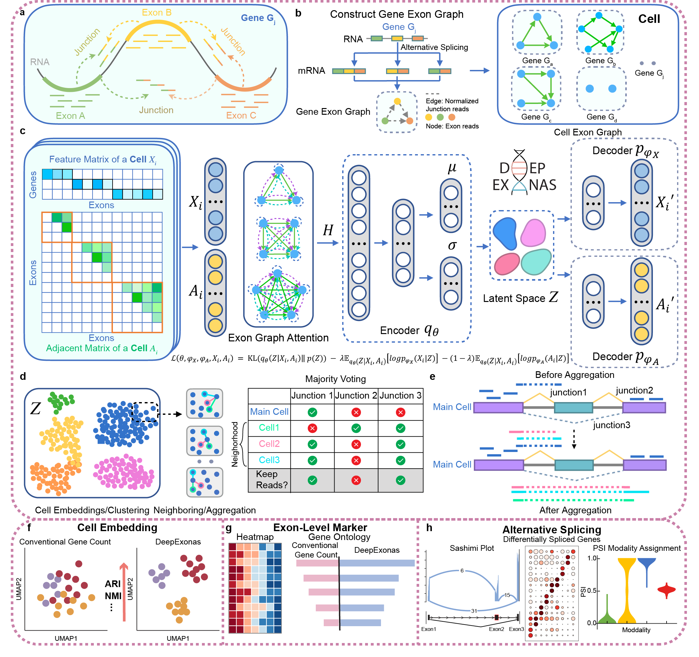

# DeepExonas
Advancing Cell Representation Beyond Gene-Level by Integrating Exon-Level Quantification and Junction Reads with Deep Neural Networks.

## Overview


## Installation

Create a new conda environment
```
conda create -n deepexonas_Env python=3.9
conda activate deepexonas_Env
```

### Option 2: Install from Github

Installing DeepExonas directly from GitHub ensures you have the latest version. 
**(Please install directly from GitHub to use the provided Jupyter notebooks for tutorials and walkthrough examples.)**

```
git clone https://github.com/mcgilldinglab/DeepExonas.git
cd DeepExonas
pip install .
```