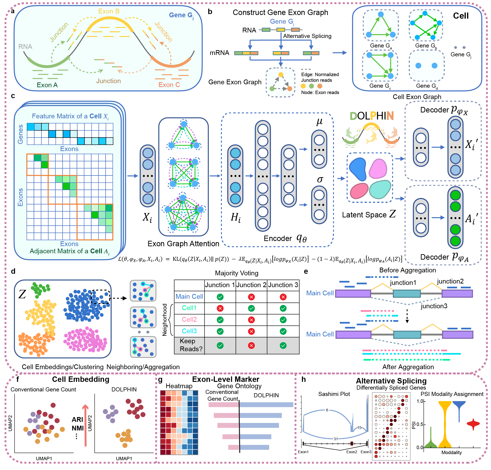

# DOLPHIN

DOLPHIN: Deep Exon-level Graph Neural Network for Single-cell Representation Learning and Alternative Splicing

Full documentation and tutorials are available at [DOLPHIN Docs](https://dolphin-sc.readthedocs.io/en/latest/).


## Overview

The advent of single-cell sequencing has revolutionized the study of cellular dynamics, providing unprecedented resolution into the molecular states and heterogeneity of individual cells. However, the rich potential of exon-level information and junction reads within single cells remains underutilized. Conventional gene-count methods overlook critical exon and junction data, limiting the quality of cell representation and downstream analyses such as subpopulation identification and alternative splicing detection. To address this, we introduce DOLPHIN, a deep learning method that integrates exon-level and junction read data, representing genes as graph structures. These graphs are processed by a variational autoencoder to improve cell embeddings. Compared to conventional gene-based methods, DOLPHIN shows superior performance in cell clustering, biomarker discovery, and alternative splicing detection, providing deeper insights into cellular processes. By examining cellular dynamics with enhanced resolution, DOLPHIN detects subtle differences often missed at the gene level, offering new insights into disease mechanisms and potential therapeutic targets.

## Key Capabilities of DOLPHIN:

- Exon-Level Quantification: It represents genes as graphs, where nodes are exons and edges are junction reads, capturing detailed transcriptomic information at the exon level.
- Better Cell Embedding: DOLPHIN leverages exon and junction read data to significantly improve the accuracy of cell embeddings, providing better resolution and resulting in more precise, biologically meaningful cell clusters compared to conventional gene-count based approaches.
- Enhanced Alternative Splicing Detection: By aggregating exon and junction reads from neighboring cells, DOLPHIN significantly enhances the detection of alternative splicing events, providing deeper insights into cell-specific splicing patterns.
- Superior Performance in Downstream Analysis: DOLPHIN consistently outperforms conventional gene-count methods in multiple downstream tasks, including the identification of differential exon markers and alternative splicing events. This high-resolution approach allows DOLPHIN to uncover biologically significant exon markers that are often missed by traditional methods.

## Installation

Installing DOLPHIN directly from GitHub ensures you have the latest version. 

### 🧠 Platform Notes

**Note:** This tool has been primarily tested on Linux-based systems, specifically Ubuntu 22.04.4 LTS. While it may run on other platforms, we recommend using a **Linux environment** for best compatibility and performance, especially for memory-intensive preprocessing steps such as **STAR** or **Cell Ranger** alignment.

>⚠️ **macOS users:** DOLPHIN is also compatible with macOS (Tested on macOS Ventura 13.0.1 with Apple M1), but **GPU acceleration is not supported** because CUDA is unavailable on this platform. All computations will run in **CPU-only mode**.

---

### 💻 Option 1: Linux Installation (Recommended)
📥 Step 1: Clone the Repository
```bash
git clone https://github.com/mcgilldinglab/DOLPHIN.git
cd DOLPHIN
```

🛠 Step 2: Create and Activate the Conda Environment
```bash
conda env create -f environment_linux.yaml
conda activate DOLPHIN
```

📦 Step 3: Install the DOLPHIN Python Package
```bash
pip install .
```

🧑‍💻 (Optional) Developer Mode Installation
```bash
pip install -e .
```

✅ Step 4: Validate the Installation
You can check if the package is correctly installed by opening Python and running:
```bash
import DOLPHIN.model
```
---

### 🍎 Option 2: macOS Installation (CPU-only)
Other steps are the same as in the Linux installation. Only Step 2 differs.

```bash
conda env create -f environment_mac.yaml
conda activate DOLPHIN
```

## Tutorials:

### Dataset Preparation

1. First, generate the exon-level reference GTF file by following the instructions in the [exon_gtf_generation](https://github.com/mcgilldinglab/DOLPHIN/blob/main/tutorial/step0_generate_exon_gtf.ipynb) tutorial.

2. Then, use the following tutorials to align the raw RNA-seq data and generate exon read counts and junction read counts:

   - For **Full-length scRNA-seq**, refer to the [Full-length scRNA-seq tutorial](https://github.com/mcgilldinglab/DOLPHIN/blob/main/tutorial/step1_1_preprocess_full_length.md).

   - For **10X RNA-seq**, refer to the [10X tutorial](https://github.com/mcgilldinglab/DOLPHIN/blob/main/tutorial/step1_2_preprocess_10X.md).
     
3. After aligning the RNA-seq data, generate the **feature matrix** and **adjacency matrix** using the provided [methods](https://github.com/mcgilldinglab/DOLPHIN/tree/main/tutorial) in the tutorial. 

### Model Training and Cell Embedding Visualization
[DOLPHIN Training and Cell Embedding](https://github.com/mcgilldinglab/DOLPHIN/blob/main/tutorial/step3_run_DOLPHIN.ipynb)

##### Run on example dataset:
You can download the processed dataset from [here](https://mcgill-my.sharepoint.com/:f:/g/personal/kailu_song_mail_mcgill_ca/EvZtHeW7qjJJs_RHc2-327ABeLXafa-ruvfk9Vs134crig?e=VBn7KG)
and follow the [example](https://github.com/mcgilldinglab/DOLPHIN/blob/main/example/run_DOLPHIN.ipynb) to run the model.

### Cell Aggregation
For a detailed tutorial on cell aggregation, please refer to the [Cell Aggregation Tutorial](./tutorial/step4_cell_aggregation.ipynb).

### Alternative Splicing Analysis
1. **Detecting Alternative Splicing using Outrigger**: 
   To detect alternative splicing events, please follow the [Alternative Splicing Detection Tutorial](./tutorial/step5_alternative_splicing.md).

2. **Alternative Splicing Analysis**:
   This section explains the alternative splicing analysis performed as described in the manuscript. For a detailed tutorial, please refer to the [Alternative Splicing Analysis](./tutorial/step6_alternative_splicing_analysis.ipynb).

### Exon-Level Differential Gene Analysis

For a detailed walkthrough of the exon-level differential gene analysis, please follow this [tutorial](./tutorial/step7_2_EDEG_analysis.ipynb).


If you find the tool is useful to your study, please consider citing the DOLPHIN [manuscript](https://doi.org/10.21203/rs.3.rs-5474597/v1).
