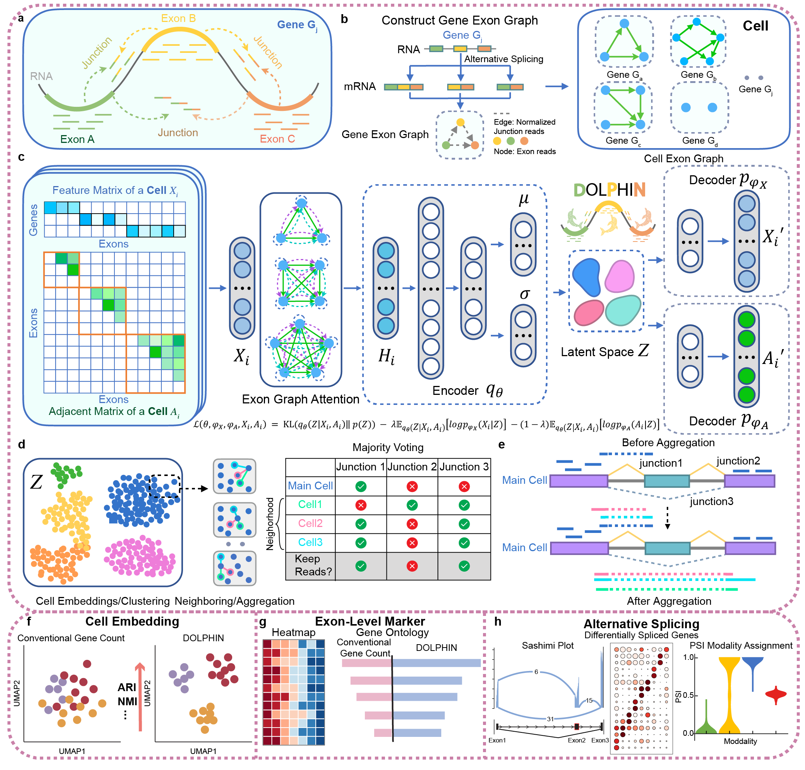

# DOLPHIN

DOLPHIN: Deep Exon-level Graph Neural Network for Single-cell Representation Learning and Alternative Splicing

## DOLPHIN v2: Clean Pipeline and Codex Skill

> [!IMPORTANT]
> DOLPHIN v2 is being prepared on the `v2-clean-pipeline` branch. The original DOLPHIN release, files, tutorials, and ReadTheDocs site remain available and are not overwritten. Codex is an optional guided interface; the DOLPHIN scientific pipeline can still be run directly from the command line.

### Versions and preserved releases

| Version | Branch or tag | Status | Purpose |
| --- | --- | --- | --- |
| DOLPHIN v2 | [`v2-clean-pipeline`](https://github.com/mcgilldinglab/DOLPHIN/tree/v2-clean-pipeline) | v2 release candidate | Finalized efficient pipeline plus the optional Codex skill |
| Original DOLPHIN | [`main`](https://github.com/mcgilldinglab/DOLPHIN/tree/main) | Current original release | Original code, README, tutorials, and ReadTheDocs workflow |
| DOLPHIN v1 snapshot | [`legacy-v1`](https://github.com/mcgilldinglab/DOLPHIN/tree/legacy-v1) / `v1.0.0-legacy` | Preserved | Permanent snapshot of the original repository before v2 |
| Zebrafish gene-ID fix | [`fix-zebrafish-gene-id-order`](https://github.com/mcgilldinglab/DOLPHIN/tree/fix-zebrafish-gene-id-order) | Targeted bug fix | Supports gene identifiers that do not end in a numeric order |

The original README continues below this v2 section without replacing its existing content. Historical releases remain reproducible through their branch or tag even as v2 evolves independently.

### What v2 provides

DOLPHIN v2 organizes the validated workflow into four connected sections:

- **Preprocessing and graph generation:** reference preparation, full-length and 10x raw-read preprocessing, pooled exon/junction matrices, and lightweight graph-store model input.
- **Model and embedding:** DOLPHIN training from the graph store and export of the final embedding to `DOLPHIN_Z.h5ad`.
- **Alternative splicing:** both BAM-level and direct-junction aggregation for full-length and 10x data, followed by the unchanged Outrigger event/index/PSI workflow.
- **EDEG and JDEG:** the historical one-cluster-vs-rest MAST workflow, followed by exon-to-gene or junction-to-gene evidence aggregation.

Full-length and 10x data follow the same high-level scientific workflow. Modality-specific code only adapts their input formats. Smoke tests and complete runs use the same implementation, with cell subsetting used only to reduce test size.

### Choose how to run v2

#### Option A: Guided execution with the Codex skill

Use this option when you want Codex to inspect inputs, ask about scientifically meaningful choices, prepare commands, monitor runs, expose errors, and verify retained outputs.

1. Clone the v2 branch and enter the repository:

   ```bash
   git clone --branch v2-clean-pipeline https://github.com/mcgilldinglab/DOLPHIN.git
   cd DOLPHIN
   ```

2. Install the Codex CLI on Linux or macOS:

   ```bash
   curl -fsSL https://chatgpt.com/codex/install.sh | sh
   ```

   See the [official Codex CLI documentation](https://developers.openai.com/codex/cli) for authentication and alternative installation methods.

3. Start Codex from the DOLPHIN repository:

   ```bash
   codex
   ```

   The repository-scoped skill is stored at `.agents/skills/dolphin-pipeline/` and is discovered automatically. Use `/skills` to inspect available skills or mention `$dolphin-pipeline` explicitly. See the [official skills documentation](https://developers.openai.com/codex/skills).

4. Start with a planning prompt that identifies the modality, input paths, output root, and available compute. For example:

   ```text
   Use $dolphin-pipeline to inspect my full-length scRNA-seq inputs, validate the
   reference files, and prepare an end-to-end run from raw reads to DOLPHIN_Z.h5ad.
   Show the plan and expected outputs before starting any expensive step.
   ```

   ```text
   Use $dolphin-pipeline to run the same validated pipeline for my 10x dataset.
   Keep durable outputs under my project directory, choose scratch storage robustly,
   and do not overwrite existing results.
   ```

5. For downstream workflows, state the required route explicitly when it affects scientific meaning:

   ```text
   Use $dolphin-pipeline to run alternative splicing for 10x data with both the BAM
   aggregation and direct-junction aggregation routes, then compare their outputs.
   ```

   ```text
   Use $dolphin-pipeline to run the historical one-cluster-vs-rest MAST EDEG and JDEG
   workflows from the finalized DOLPHIN outputs.
   ```

Codex should confirm the full-length versus 10x modality, the alternative-splicing route, durable and scratch locations, resource-intensive runs, and any operation that could overwrite results. It must not change Outrigger semantics or the historical EDEG/JDEG statistical design without explicit approval.

#### Option B: Direct command-line execution

Codex is not required. Create the DOLPHIN environment, install the package, and use the finalized Python entry points directly:

```bash
conda env create -f environment.yaml
conda activate DOLPHIN
pip install -e .
```

The v2 workflow documentation is organized by task:

- [Preprocessing and graph generation](docs/preprocessing/README.md)
- [Model training and embedding](docs/model/README.md)
- [Alternative splicing](docs/alternative_splicing/README.md)
- [EDEG and JDEG](docs/edeg/README.md)
- [Retained pipeline outputs](docs/PIPELINE_OUTPUTS.md)
- [Mapping from original functions to v2](docs/ORIGINAL_FUNCTION_COVERAGE.md)

External tools such as STAR, featureCounts/Subread, samtools, bedtools, R/Seurat/MAST, and Outrigger are required only by the corresponding stages. Validate each stage's environment before launching a full dataset.

### Main retained outputs

| Stage | Main retained outputs | Purpose |
| --- | --- | --- |
| Reference preparation | `reference_manifest.json`, exon GTF/index files, optional `star_index/` | Shared exon and junction reference bundle |
| Raw preprocessing | `cell_manifest.tsv` and grouped gene/exon/junction count tables | Stable full-length or 10x handoff |
| Graph generation | pooled feature and adjacency H5AD files | Exon-level graph matrices without retained per-cell graph fragments |
| Model input | `model_<out_name>.graph.json`, `model_<out_name>.edges.h5` | Lightweight lazy graph store |
| Model training | `DOLPHIN_Z.h5ad` | Final cell embedding |
| Alternative splicing | `PSI.h5ad`, `PSI_random.h5ad`, `PSI_DAS.h5ad` | PSI matrices and differential AS results |
| EDEG/JDEG | per-cluster MAST tables and gene-level summaries | Historical one-vs-rest differential analysis |

Temporary files may be placed on fast local scratch storage when available, but durable outputs remain under a user-selected project directory. The pipeline does not require a specific server path such as `/tmp` or `/mnt/md0`.

---

## Original DOLPHIN README

Full documentation and tutorials are available at [DOLPHIN Docs](https://dolphin-sc.readthedocs.io/en/latest/).


## Overview

The advent of single-cell sequencing has revolutionized the study of cellular dynamics, providing unprecedented resolution into the molecular states and heterogeneity of individual cells. However, the rich potential of exon-level information and junction reads within single cells remains underutilized. Conventional gene-count methods overlook critical exon and junction data, limiting the quality of cell representation and downstream analyses such as subpopulation identification and alternative splicing detection. To address this, we introduce DOLPHIN, a deep learning method that integrates exon-level and junction read data, representing genes as graph structures. These graphs are processed by a variational autoencoder to improve cell embeddings. Compared to conventional gene-based methods, DOLPHIN shows superior performance in cell clustering, biomarker discovery, and alternative splicing detection, providing deeper insights into cellular processes. By examining cellular dynamics with enhanced resolution, DOLPHIN detects subtle differences often missed at the gene level, offering new insights into disease mechanisms and potential therapeutic targets.

## Key Capabilities of DOLPHIN:

- Exon-Level Quantification: It represents genes as graphs, where nodes are exons and edges are junction reads, capturing detailed transcriptomic information at the exon level.
- Better Cell Embedding: DOLPHIN leverages exon and junction read data to significantly improve the accuracy of cell embeddings, providing better resolution and resulting in more precise, biologically meaningful cell clusters compared to conventional gene-count based approaches.
- Enhanced Alternative Splicing Detection: By aggregating exon and junction reads from neighboring cells, DOLPHIN significantly enhances the detection of alternative splicing events, providing deeper insights into cell-specific splicing patterns.
- Superior Performance in Downstream Analysis: DOLPHIN consistently outperforms conventional gene-count methods in multiple downstream tasks, including the identification of differential exon markers and alternative splicing events. This high-resolution approach allows DOLPHIN to uncover biologically significant exon markers that are often missed by traditional methods.

## Installation

Installing DOLPHIN directly from GitHub ensures you have the latest version. 

### 🧠 Platform Notes

**Note:** This tool has been primarily tested on Linux-based systems, specifically Ubuntu 22.04.4 LTS. While it may run on other platforms, we recommend using a **Linux environment** for best compatibility and performance, especially for memory-intensive preprocessing steps such as **STAR** or **Cell Ranger** alignment.

>⚠️ **macOS users:** DOLPHIN is also compatible with macOS (Tested on macOS Ventura 13.0.1 with Apple M1, and Sequoia 15.3.2 with Apple M2 Pro), but **GPU acceleration is not supported** because CUDA is unavailable on this platform. All computations will run in **CPU-only mode**.

---

### 💻 Option 1: Linux Installation (Recommended)
📥 Step 1: Clone the Repository
```bash
git clone https://github.com/mcgilldinglab/DOLPHIN.git
cd DOLPHIN
```

🛠 Step 2: Create and Activate the Conda Environment
```bash
conda env create -f environment_linux.yaml
conda activate DOLPHIN
```

📦 Step 3: Install the DOLPHIN Python Package
```bash
pip install .
```

🧑‍💻 (Optional) Developer Mode Installation
```bash
pip install -e .
```

✅ Step 4: Validate the Installation
You can check if the package is correctly installed by opening Python and running:
```bash
import DOLPHIN.model
```
---

### 🍎 Option 2: macOS Installation (CPU-only)
Other steps are the same as in the Linux installation. Only Step 2 differs. Once Step 2 is complete, resume from **Step 3** of the Linux installation to finish the setup.


```bash
conda env create -f environment_mac.yaml
conda activate DOLPHIN
```

## Tutorials:

### Dataset Preparation

1. First, generate the exon-level reference GTF file by following the instructions in the [exon_gtf_generation](./docs/source/tutorials/step0_generate_exon_gtf_final.ipynb) tutorial.

2. Then, use the following tutorials to align the raw RNA-seq data and generate exon read counts and junction read counts:

   - For **Full-length scRNA-seq**, refer to the [Full-length scRNA-seq tutorial](./docs/source/tutorials/step1_1_preprocess_full_length.md).

   - For **10X RNA-seq**, refer to the [10X tutorial](./docs/source/tutorials/step1_2_preprocess_10X.md).
     
3. After aligning the RNA-seq data, generate the **feature matrix** and **adjacency matrix** using the provided [methods](./docs/source/tutorials/step2_graph_generation.ipynb) in the tutorial. 

### Model Training and Cell Embedding Visualization
[DOLPHIN Training and Cell Embedding](./docs/source/examples/run_DOLPHIN_flashseq.ipynb)

##### Run on example dataset:
You can download the processed dataset from [here](https://mcgill-my.sharepoint.com/:f:/g/personal/kailu_song_mail_mcgill_ca/EvZtHeW7qjJJs_RHc2-327ABeLXafa-ruvfk9Vs134crig?e=kEPtAV)
and follow the [example](./docs/source/examples/run_DOLPHIN_flashseq.ipynb) to run the model.

### Cell Aggregation
For a detailed tutorial on cell aggregation, please refer to the [Cell Aggregation Tutorial](./docs/source/tutorials/step4_cell_aggregation.ipynb).

### Alternative Splicing Analysis
1. **Detecting Alternative Splicing using Outrigger**: 
   To detect alternative splicing events, please follow the [Alternative Splicing Detection Tutorial](./docs/source/tutorials/step5_alternative_splicing.md).

2. **Alternative Splicing Analysis**:
   This section explains the alternative splicing analysis performed as described in the manuscript. For a detailed tutorial, please refer to the [Alternative Splicing Analysis](./docs/source/tutorials/step6_alternative_splicing_analysis.ipynb).

### Exon-Level Differential Gene Analysis

For a detailed walkthrough of the exon-level differential gene analysis, please follow this [tutorial](./docs/source/tutorials/step7_1_MAST.ipynb).

If you find the tool is useful to your study, please consider citing the DOLPHIN [manuscript](https://doi.org/10.21203/rs.3.rs-5474597/v1).
