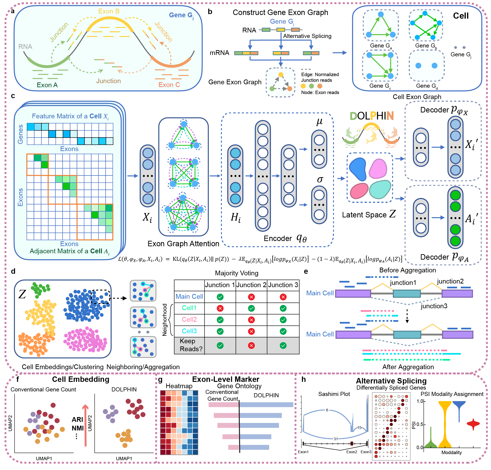

Welcome to DOLPHIN's documentation!
===================================

**DOLPHIN** is a Python package for analysis single-cell RNA-seq at exon level including cell clusters, 
differential gene analysis at exon level, alternative splicing. 

.. toctree::
   :maxdepth: 2
   :caption: Getting started with DOLPHIN:

   usage.md

.. toctree::
   :maxdepth: 1
   :caption: Examples

   examples/index.rst

.. toctree::
   :maxdepth: 1
   :caption: Tutorials

   tutorials/index.rst

.. toctree::
   :maxdepth: 1
   :caption: API Documentations

   api/index.rst