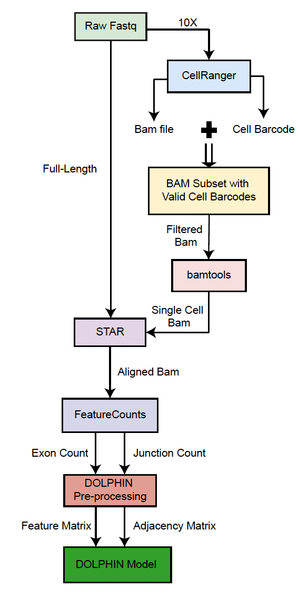

# Preprocessing 10X Single-Cell RNA-Seq for Exon and Junction Read Counts

Here is the brief pipeline for full-length and 10x single-cell RNA-seq shown:



## Step 1: Download Required Tools

Before starting the alignment process, make sure to download and install the following tools:

[STAR](https://github.com/alexdobin/STAR) >=2.7.3a

[featurecounts](https://sourceforge.net/projects/subread/files/subread-2.0.8/) >=2.0.3

[cellranger](https://www.10xgenomics.com/support/software/cell-ranger/latest/tutorials/cr-tutorial-in) >= 7.0.1

[subset-bam](https://github.com/10XGenomics/subset-bam)

[bamtools](https://github.com/pezmaster31/bamtools)
## Step 2: Create a Reference Genome

Run the following command to generate a reference genome for alignment using STAR. 
- `ensembl_mod_indx` is the directory where the reference genome index will be stored.
- `Homo_sapiens.GRCh38.dna_sm.primary_assembly.fa` can be downloaded [here](https://ftp.ensembl.org/pub/release-113/fasta/homo_sapiens/dna/).
- `Homo_sapiens.GRCh38.107.exon.gtf` is generated using the [file](./step0_generate_exon_gtf_final.ipynb).


```bash
STAR --runMode genomeGenerate \
    --genomeDir /mnt/data/kailu/STAR_example/ensembl_mod_indx/ \
    --genomeFastaFiles Homo_sapiens.GRCh38.dna_sm.primary_assembly.fa \
    --sjdbGTFfile Homo_sapiens.GRCh38.107.exon.gtf \
    --runThreadN 16
```

## Step 3: Download the Raw RNA-Seq Files

Download the raw RNA-seq files from the provided sources. For the links to the human colon and rectum raw data, please refer to the original [study](https://rupress.org/jem/article/217/2/e20191130/132578/Single-cell-transcriptome-analysis-reveals). For the PDAC dataset, you can find it [here](https://www.nature.com/articles/s41422-019-0195-y).

For 10X single-cell RNA-seq, we will first use Cell Ranger to generate the cell BAM file and extract the cell barcodes. Afterward, we will split the cell barcodes and process one cell at a time.

## Step 4: Obtain Cell Barcodes and BAM File

Use Cell Ranger to align the data to the reference [genome](https://www.10xgenomics.com/support/software/cell-ranger/downloads) and generate the cell barcodes and BAM file.

```bash
cellranger count --id=T10_std_cellranger \
    --fastqs=/mnt/data/kailu/00_scExon/10_GO_PDAC/00_data_generation/00_raw/T10/ \
    --sample=CRR034505 \
    --transcriptome=refdata-gex-GRCh38-2020-A \
    --chemistry=SC3Pv2
```

## Step 5: Subset BAM File to Retain Valid Cells with Cell Barcodes

In this step, we will subset the BAM file to keep only the valid cells, 
identified by their respective cell barcodes. 
This ensures that downstream analysis is performed on valid cells.

```bash
subset-bam_linux --bam ./T10_std_cellranger/outs/possorted_genome_bam.bam \
    --cell-barcodes T10_CB.csv \
    --bam-tag CB:Z \
    --log-level debug \
    --out-bam /mnt/data/kailu/00_scExon/10_GO_PDAC/00_data_generation/02_single_std_bam/T10/PADC_sub_T10.bam

```

## Step 6: Split into Single-Cell BAM Files
In this step, we will split the BAM file into individual single-cell BAM files, each corresponding to a specific cell barcode. This allows us to process and analyze one cell at a time in the subsequent steps.

```bash
bamtools split -in /mnt/data/kailu/00_scExon/10_GO_PDAC/00_data_generation/02_single_std_bam/T10/PADC_sub_T10.bam -tag CB
```

## Step7: STAR Alignment 
```bash
## `ID_SAMPLE` is the Cell Barcode Name
mkdir ./03_exon_star/${ID_SAMPLE}
STAR --runThreadN 16 \
    --genomeDir /mnt/data/kailu/STAR_example/ensembl_mod_indx/ \
    --readFilesIn ./02_single_std_bam/T10/PADC_sub_T10.TAG_CB_${ID_SAMPLE}.bam \
    --readFilesCommand samtools view -F 0x100 \
    --outSAMtype BAM SortedByCoordinate \
    --readFilesType SAM SE \
    --outFileNamePrefix ./03_exon_star/${ID_SAMPLE}/${ID_SAMPLE}.

mkdir ./02_exon_std/${ID_SAMPLE}
STAR --runThreadN 16 \
    --genomeDir /mnt/data/kailu/STAR_example/ensembl_indx/ \
    --readFilesIn ./02_single_std_bam/T10/PADC_sub_T10.TAG_CB_${ID_SAMPLE}.bam \
    --readFilesCommand samtools view -F 0x100 \
    --outSAMtype BAM SortedByCoordinate \
    --readFilesType SAM SE \
    --outFileNamePrefix ./02_exon_std/${ID_SAMPLE}/${ID_SAMPLE}.std.
```

## Step 8: Count Exon Reads and Junction Reads

Get exon gene count using the modified exon GTF file. This will generate the gene count (`${ID_SAMPLE}.exongene.count.txt`), which will be used later for HVG identification.

```bash
mkdir ./04_exon_gene_cnt
featureCounts -t exon -O -M \
    -a Homo_sapiens.GRCh38.107.exon.gtf \
    -o ./04_exon_gene_cnt/${ID_SAMPLE}.exongene.count.txt \
    ./03_exon_star/${ID_SAMPLE}/${ID_SAMPLE}.Aligned.sortedByCoord.out.bam
```

Run the following command to get the exon and junction counts. This step will generate the following files:
- `${ID_SAMPLE}.exon.count.txt`: Exon read counts.
- `${ID_SAMPLE}.exon.count.txt.jcounts`: Junction read counts.

```bash
mkdir ./05_exon_junct_cnt
featureCounts -t exon -f -O -J -M \
    -a Homo_sapiens.GRCh38.107.exon.gtf \
    -o ./05_exon_junct_cnt/${ID_SAMPLE}.exon.count.txt \
    ./03_exon_star/${ID_SAMPLE}/${ID_SAMPLE}.Aligned.sortedByCoord.out.bam
```