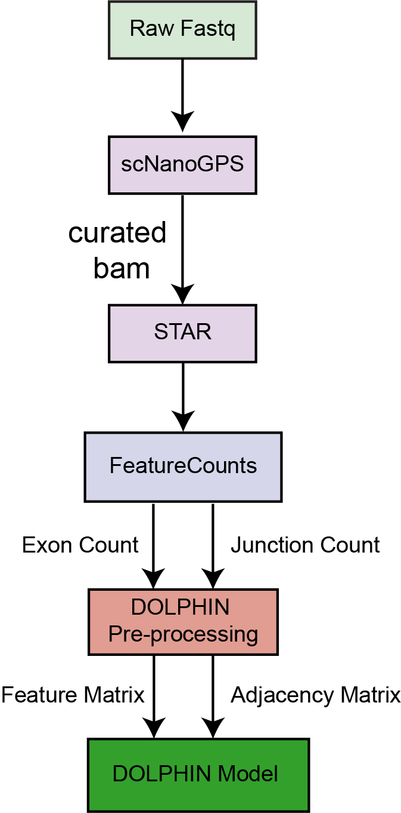

# Preprocessing Long-read Single-Cell RNA-Seq for Exon and Junction Read Counts

Here is the brief pipeline for long-read single-cell RNA-seq shown:



## Step 1: Download Required Tools

Before starting the alignment process, make sure to download and install the following tools:

[STAR](https://github.com/alexdobin/STAR) >=2.7.3a

[featurecounts](https://sourceforge.net/projects/subread/files/subread-2.0.8/) >=2.0.3

[cellranger](https://www.10xgenomics.com/support/software/cell-ranger/latest/tutorials/cr-tutorial-in) >= 7.0.1

[subset-bam](https://github.com/10XGenomics/subset-bam)

[bamtools](https://github.com/pezmaster31/bamtools)

[scNanoGPS](https://github.com/gaolabtools/scNanoGPS)

## Step 1: Follow the scNanoGPS pipeline to obtain the curated BAM file.

## Step 2: Create a Reference Genome

Run the following command to generate a reference genome for alignment using STAR. 
- `ensembl_mod_indx` is the directory where the reference genome index will be stored.
- `Homo_sapiens.GRCh38.dna_sm.primary_assembly.fa` can be downloaded [here](https://ftp.ensembl.org/pub/release-113/fasta/homo_sapiens/dna/).
- `Homo_sapiens.GRCh38.107.exon.gtf` is generated using the [file](./step0_generate_exon_gtf_final.ipynb).


```bash
STAR --runMode genomeGenerate \
    --genomeDir /mnt/data/kailu/STAR_example/ensembl_mod_indx/ \
    --genomeFastaFiles Homo_sapiens.GRCh38.dna_sm.primary_assembly.fa \
    --sjdbGTFfile Homo_sapiens.GRCh38.107.exon.gtf \
    --runThreadN 16
```

## Step3: STAR Alignment - align to modifed exon gtf file and standard reference genome
```bash
## `ID_SAMPLE` is the Cell Barcode Name
mkdir ./03_exon_star/${ID_SAMPLE}
STAR --runThreadN 16 \
    --genomeDir /mnt/data/kailu/STAR_example/ensembl_mod_indx/ \
    --readFilesIn ./00_scNanogps/MEL2/curated.minimap2.bam/$ID_SAMPLE.curated.minimap2.bam \
    --readFilesCommand samtools view -F 0x100 \
    --outSAMtype BAM SortedByCoordinate \
    --readFilesType SAM SE \
    --outFileNamePrefix ./03_exon_star/${ID_SAMPLE}/${ID_SAMPLE}.

mkdir ./02_exon_std/${ID_SAMPLE}
STAR --runThreadN 4 \
    --genomeDir /mnt/data/kailu/STAR_example/ensembl_indx/ \
    --readFilesIn ./00_scNanogps/MEL2/curated.minimap2.bam/$ID_SAMPLE.curated.minimap2.bam \
    --readFilesCommand samtools view -F 0x100 \
    --outSAMtype BAM SortedByCoordinate \
    --outFileNamePrefix ./02_exon_std/${ID_SAMPLE}/${ID_SAMPLE}.std.
```

## Step 4: Count Exon Reads and Junction Reads

Get exon gene count using the modified exon GTF file. This will generate the gene count (`${ID_SAMPLE}.exongene.count.txt`), which will be used later for HVG identification.

```bash
mkdir ./04_exon_gene_cnt
featureCounts -t exon -O -M \
    -a Homo_sapiens.GRCh38.107.exon.gtf \
    -o ./04_exon_gene_cnt/${ID_SAMPLE}.exongene.count.txt \
    ./03_exon_star/${ID_SAMPLE}/${ID_SAMPLE}.Aligned.sortedByCoord.out.bam
```

Run the following command to get the exon and junction counts. This step will generate the following files:
- `${ID_SAMPLE}.exon.count.txt`: Exon read counts.
- `${ID_SAMPLE}.exon.count.txt.jcounts`: Junction read counts.

```bash
mkdir ./05_exon_junct_cnt
featureCounts -t exon -f -O -J -M \
    -a Homo_sapiens.GRCh38.107.exon.gtf \
    -o ./05_exon_junct_cnt/${ID_SAMPLE}.exon.count.txt \
    ./03_exon_star/${ID_SAMPLE}/${ID_SAMPLE}.Aligned.sortedByCoord.out.bam
```